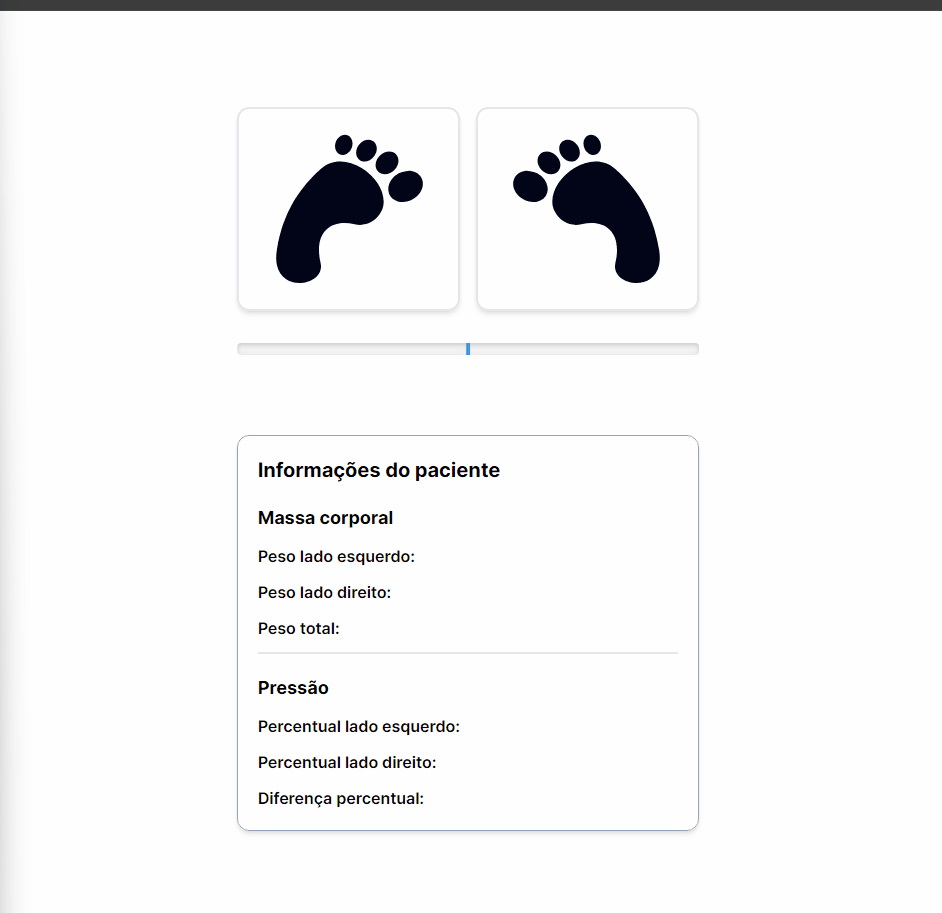

<h1 align="center">
  UNISINOS - IoT Extension Project
</h1>

<p align="center">
  <a target="_blank" href="https://react.dev/">
    
  </a>
  <a target="_blank" href="https://nextjs.org/">
    
  </a>
  <a target="_blank" href="https://www.typescriptlang.org/">
    
  </a>
  <a target="_blank" href="https://tailwindcss.com/">
    
  </a>
</p>

<div align="center">
  
</div>

## About the Project

The Pressure Plates project aims to address the uneven force distribution on a person's legs while standing, providing a visual solution to identify and analyze possible imbalances. In normal situations, force is evenly distributed between the legs; however, in cases of muscle or bone injuries, this distribution can be compromised.

[**Aplicação frontend**](https://202302-unisinos-iot-pressure-plate.vercel.app/) <br />
[**Simulador do microcontrolador**](https://wokwi.com/projects/382779389314853889)

## Technologies

- _[TypeScript](https://www.typescriptlang.org/)_
- _[React](https://react.dev/)_
- _[Next.js](https://nextjs.org/)_
- _[Tailwind](https://tailwindcss.com/)_
- _[Eslint](https://eslint.org/)_

## How to Run this Project

To clone and run this application, you'll need [Git](https://git-scm.com), [Node.js](https://nodejs.org/) and [NPM](https://www.npmjs.com/) installed on your computer.

### Requirements and Versions

- Node.js: >= 18.17.0
- NPM: >= 6.0.0
- NPX: >= 5.2.0
- Yarn: >= 3

### Clone the Repository

```bash
# Clone with https
$ git clone https://github.com/vitormarco/202302-unisinos-iot-pressure-plate.git

# or

# Cloning with SSH
$ git clone git@github.com:vitormarco/202302-unisinos-iot-pressure-plate.git

# Access the project folder in the terminal/cmd
$ cd 202302-unisinos-iot-pressure-plate
```

### 🚀 Start the Project

```bash
# Install all dependencies
$ yarn

# Run the project in development mode
$ yarn dev
```

### Comandos

- `dev`: Run the application on localhost:3000
- `build`: Creates the project build
- `start`: Runs the application according to the generated production build
- `format`: Run _prettier_ lint on all components and pages
- `lint`: Run _next_ lint on all components and pages
- `commit`: Performs commit and push according to _git_ conventions
